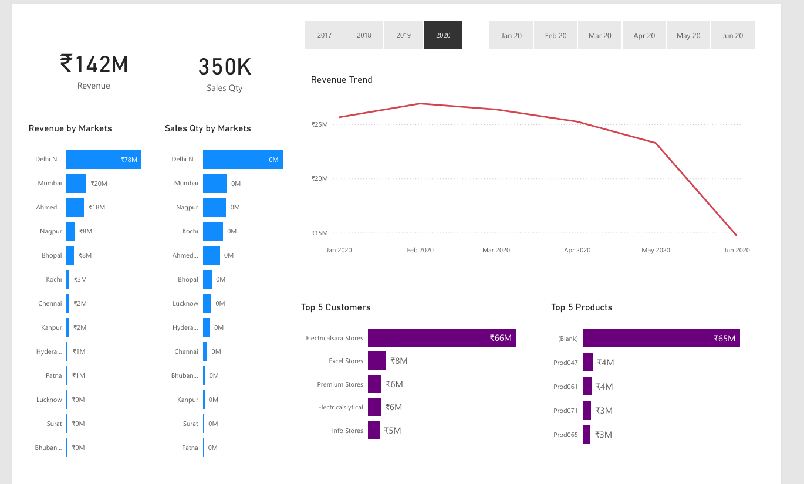

# Sales Dashboard

The Sales Dashboard is a comprehensive tool designed to provide insights into sales performance. It consolidates sales data from various sources and presents it in an interactive and user-friendly format. The dashboard helps stakeholders make informed decisions by visualizing key metrics and trends.

## Features

- **Sales Overview:** Provides a high-level summary of total sales, targets, and achievements.
- **Sales Trends:** Visualizes sales trends over time to identify patterns and seasonality.
- **Top Products:** Highlights the best-performing products based on sales volume and revenue.
- **Sales by Region:** Displays sales performance across different geographical regions.
- **Sales Team Performance:** Tracks the performance of individual sales team members.
- **Customer Insights:** Analyzes customer behavior and purchasing patterns.
- **Interactive Filters:** Allows users to drill down into specific data segments using various filters (e.g., time period, region, product category).

## Installation

### Prerequisites

- Power BI Desktop installed on your computer. You can download it from [here](https://www.microsoft.com/en-us/download/details.aspx?id=58494).
- Access to the relevant sales data sources (e.g., databases, Excel files, cloud services).

### Steps

1. Download the Sales Dashboard Power BI file (`Sales_Dashboard.pbix`).
2. Open Power BI Desktop.
3. In Power BI Desktop, go to `File` > `Open` and select the `Sales_Dashboard.pbix` file.
4. Connect to your data sources and update the data connections as needed.
5. Refresh the data to load the latest sales information.
6. Save the updated Power BI file.

## Usage

- Navigate through the different tabs of the dashboard to explore various sales metrics.
- Use filters and slicers to drill down into specific data points.
- Export visualizations and reports as needed for presentations or further analysis.

## Contact

For any queries or support, please contact Abhishek Singh Tomar at [officialabhitomar@gmail.com](mailto:officialabhitomar@gmail.com).
